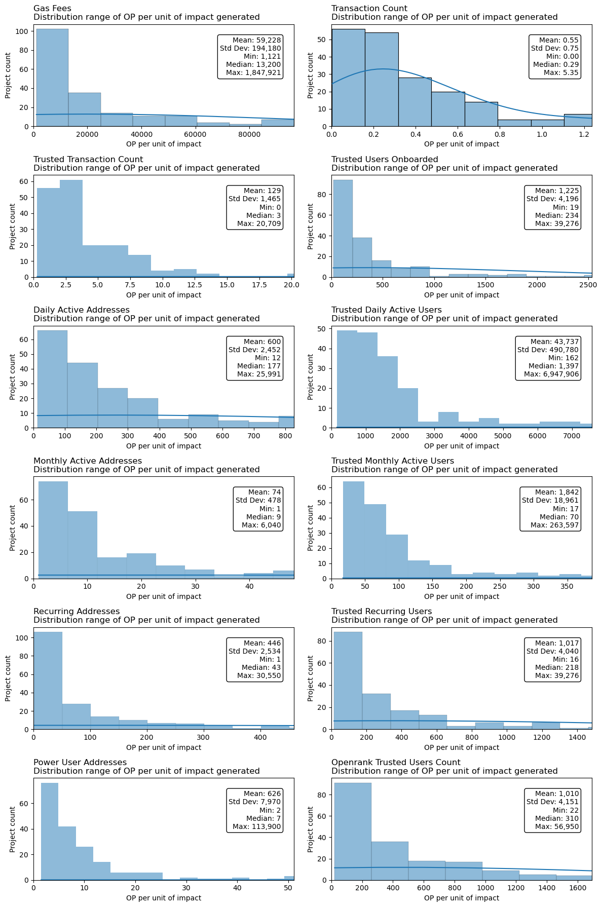

# Retro Funding 4 Budget Analysis

## TL;DR-

A total of 10,000,000 OP was allocated to Retro Funding 4. This analysis evaluates spending efficiency by calculating OP spent per unit of impact across chains and projects.

- `num_address`: 1.80 OP per address
- `num_trusted_users`: 55 OP per trusted user
- `total_gas`: 4,139 OP per ETH
- `collective_contribution`: 14,461 OP per ETH

Caveat: these figures are only a crude benchmark for Retro Funding 4’s spending efficiency and future token allocations. 

---

## 1. Methodology

### 1.1 Scope of the Data

We pulled activity metrics (e.g., gas fees, transactions, users onboarded) relevant to the round, focusing on the period between 2023-10-01 and 2024-06-01. Our aggregated tables combine on-chain data (pre- and post-EIP-4844) from all relevant networks—Optimism, Base, Mode, Zora, FRAX, and others.

### 1.2 Levels of Aggregation

- **Superchain-Level**: Aggregated across all chains (e.g., total unique addresses interacting on any chain).  
- **Chain-Level**: Aggregated across all projects on a particular chain (e.g., total gas fees on Base).  
- **Project-Level**: Aggregated across all users for a single project (e.g., monthly active users).

### 1.3 Key Metrics

We calculate the total amount of OP spent per unit of impact (e.g., “OP per ETH in gas fees”). The key metrics at the Superchain and chain levels are:

  - `num_address`: Total distinct addresses interacting with eligible projects  
  - `num_trusted_users`: Total unique trusted users interacting with eligible projects  
  - `total_gas`: Total ETH gas usage aggregated across projects  
  - `collective_contribution`: ETH-equivalent “collective contribution,” calculated as:
    - **Optimism**: 100% * (pre_4844_gas_fees × 0.5 + post_4844_gas_fees × 0.95)  
    - **Other Chains**: 15% * (pre_4844_gas_fees × 0.5 + post_4844_gas_fees × 0.95)

At the project level, we also calculate metrics like `gas_fees`, `transaction_count`, `trusted_users_onboarded`, etc., and visualize them with KDE plots.

### 1.4 Total OP Allocated

The Retro Funding 4 allocation was **10,000,000 OP**, which is used as the basis for the “OP per unit of impact” calculations.

---

## 2. Results

### 2.1 OP Spent per ETH in Gas Fees Rewarded

- **Superchain-Level**  
  - **Overall**: **4,139 OP per ETH**  
  - **Pre-EIP-4844**: ~9,958 OP per ETH  
  - **Post-EIP-4844**: ~7,086 OP per ETH  

  These figures come from dividing 10,000,000 OP by the aggregated gas fees before and after EIP-4844 across all approved projects. (We don't have a good way of determing how much OP should be allocated to a given chain.)

- **Chain-Level**  
  | **Chain**    | **Total Gas (ETH)** | **OP per ETH in Gas Fees** |
  |--------------|---------------------|----------------------------|
  | **ZORA**     | 191.546084         | ~52,218                    |
  | **OPTIMISM** | 763.539737         | ~13,093                    |
  | **MODE**     | 184.009741         | ~54,347                    |
  | **BASE**     | 1276.421150        | ~7,837                     |
  | **FRAX**     | 0.032961           | ~303,402,261               |

> **Note**: Frax’s extremely high OP/ETH ratio is due to minimal total gas usage.

---

### 2.2 OP Spent per ETH in Collective Contributions

- **Superchain-Level**  
  - **Overall**: **14,461 OP per ETH**  
    - 10,000,000 OP ÷ (sum of `collective_contribution` across all chains)

- **Chain-Level**  
  | **Chain**    | **Collective Contribution (ETH)** | **OP per ETH**          |
  |--------------|-----------------------------------|-------------------------|
  | **ZORA**     | 14.688762                         | ~680,249                |
  | **OPTIMISM** | 488.325937                        | ~20,484                 |
  | **MODE**     | 14.962287                         | ~668,202                |
  | **BASE**     | 173.527027                        | ~57,615                 |
  | **FRAX**     | 0.003342                          | ~2,991,065,816          |

---

### 2.3 OP Spent per Trusted User

- **Chain-Level Summation**  
  Summing “unique_users” across Optimism, Base, Mode, Zora, and Frax yields ~181,295 trusted-user records (with possible duplicates across chains). 10,000,000 OP ÷ 181,295 ≈ **55 OP per trusted user**.

- **Superchain-Level Distinct**  
  At the superchain level, there are ~69,704 truly distinct trusted users. 10,000,000 OP ÷ 69,704 ≈ **143 OP per distinct trusted user**.

---

### 2.4 OP Spent per Active Address

- **Chain-Level Summation**  
  Summing `num_address` across all chains gives ~5,563,016 addresses. 10,000,000 OP ÷ 5,563,016 ≈ **1.80 OP per address** (duplicate addresses across chains may be counted more than once).

- **Superchain-Level Distinct**  
  The superchain-wide distinct address count is ~3,766,317. 10,000,000 OP ÷ 3,766,317 ≈ **2.66 OP per distinct active address**.

---

## 3. Project-Level Results

We calculated OP spent per unit of impact at the project level and visualized it via KDE plots for each relevant metric (e.g., `gas_fees`, `transaction_count`, `monthly_active_addresses`). Below is an example plot:

---

## Final Remarks

These “OP per unit of impact” calculations should only be used as a crude benchmark for Retro Funding 4’s spending efficiency and future airdrops, grants, and Retro Funding rounds. Of course, some of this impact would have happened without Retro Funding 4, and some of it was likely incentived by other programs. Nonetheless, these metrics provide a useful starting point for understanding how much OP was spent per unit of impact during Retro Funding 4.

---

## Appendix

The following notebook contains the code used to generate the results in this analysis: [20250110_RF4_BuilderBudgeting.ipynb](./20250110_RF4_BuilderBudgeting.ipynb)

