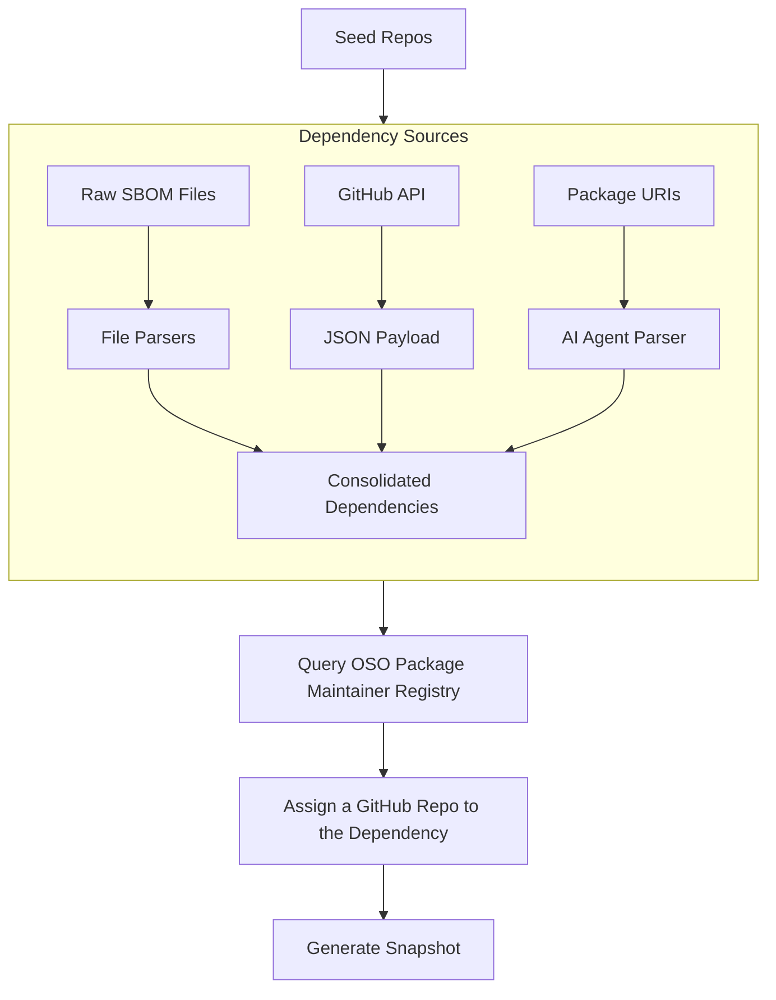

# Dependency Graph v2

A tool for analyzing and visualizing dependencies across multiple repositories. This project helps you track and manage dependencies from various sources, map them to GitHub repositories, and generate comprehensive dependency snapshots.

## Features

- **Multiple Dependency Sources**: Fetch dependencies from different sources:
  - GitHub API (using GraphQL)
  - Package files analysis (using Gemini AI)
  - SPDX SBOM files (JSON and CSV formats)
- **Repository-specific Updates**: Update dependencies for specific repositories without affecting others
- **Dependency Snapshots**: Generate snapshots of dependencies across all repositories
- **Interactive Workflow**: Guided workflow for analyzing repositories
- **GitHub Repository Mapping**: Map dependencies to their source GitHub repositories using OSO's deps.dev package model
- **Dependency Cleaning**: Clean and flatten dependency data for easier analysis

## Setup

1. Clone the repository
2. Install dependencies with Poetry:
   ```bash
   poetry install
   poetry shell
   ```
3. Create a `.env` file with the following variables (see `.env.example`):
   ```
   OSO_API_KEY=your_oso_api_key
   GITHUB_TOKEN=your_github_token
   GEMINI_API_KEY=your_gemini_api_key
   ```

To get an OSO API key, go [here](https://docs.opensource.observer/docs/get-started/python).

## Usage

### CLI Commands

All functionality is available through the CLI interface:

```bash
python -m src.cli.main_cli [COMMAND] [OPTIONS]
```

### Initialize Repository Sources

```bash
python -m src.core.initialize_repository_sources
```

### Repository Analysis Workflow

The interactive workflow guides you through analyzing a repository:

```bash
python -m src.cli.main_cli dependencies analyze-repo https://github.com/username/repo
```

### Dependency Management

#### Fetch Dependencies

```bash
# Fetch from all sources
python -m src.cli.main_cli dependencies fetch --repo-url https://github.com/username/repo

# Fetch from a specific source
python -m src.cli.main_cli dependencies fetch --repo-url https://github.com/username/repo --source github_api
```

#### Import SBOM Files

```bash
# JSON Format
python -m src.cli.main_cli dependencies import-sbom path/to/sbom.json https://github.com/username/repo

# CSV Format
python -m src.cli.main_cli dependencies import-csv path/to/sbom.csv https://github.com/username/repo
```

#### Map Dependencies to GitHub

Map dependencies to their source GitHub repositories:

```bash
python -m src.cli.main_cli dependencies map-to-github
```

#### Clean Dependencies

Clean and flatten the dependency data:

```bash
python -m src.cli.main_cli dependencies clean
```

#### Generate Dependency Snapshot

```bash
python -m src.cli.main_cli dependencies generate-snapshot
```

### Repository Management

```bash
# List all repositories
python -m src.cli.main_cli dependencies list-repos

# Show repository status
python -m src.cli.main_cli dependencies status

# Add a dependency file to a repository
python -m src.cli.main_cli dependencies add-file https://github.com/username/repo https://github.com/username/repo/blob/master/package.json
```

## Project Structure

```
dependency-graph-v2/
├── data/                      # Data storage
│   ├── package_github_mappings.csv  # Cache for package-to-GitHub mappings
│   ├── repository_sources.json      # Repository source configurations
│   └── sbom_exports/               # SBOM export files
├── output/                    # Output files
│   ├── cleaned_dependencies.json    # Cleaned dependency data
│   ├── dependencies.json            # Raw dependency data
│   ├── dependencies_with_github.json # Dependencies with GitHub mappings
│   ├── dependency_snapshot.json     # Dependency snapshot
│   └── repo_status.txt              # Repository status
├── src/                       # Source code
│   ├── cli/                   # Command-line interface
│   ├── config/                # Configuration and settings
│   │   └── prompts/           # AI prompts for analysis
│   ├── core/                  # Core domain logic and data management
│   ├── services/              # External services and integrations
│   ├── dependency/            # Dependency-specific operations
│   ├── importers/             # Data import functionality
│   └── utils/                 # Utility functions
├── .env.example               # Example environment variables
├── poetry.lock                # Poetry lock file
├── pyproject.toml             # Poetry project configuration
└── README.md                  # Project documentation
```

## Dependency Processing Pipeline

The dependency processing pipeline consists of the following steps:

1. **Identify Seed Repos**: Define the repositories to analyze for dependencies
2. **Dependency Sources**: Extract dependencies from multiple sources:
   - **GitHub API**: Query dependency manifests directly from GitHub using GraphQL
   - **SBOM Files**: Import from SPDX SBOM files (JSON and CSV formats)
   - **Package Files**: Analyze package files using AI (Gemini) for complex parsing
3. **Map to GitHub**: Map dependencies to their source GitHub repositories using OSO's deps.dev API
4. **Clean Dependencies**: Clean, flatten, and standardize the dependency data
5. **Generate Snapshot**: Create comprehensive snapshots with statistics and aggregated data



## Output Files

- `output/dependencies.json`: Raw dependency data from all sources
- `output/dependencies_with_github.json`: Dependencies with GitHub repository mappings
- `output/cleaned_dependencies.json`: Cleaned and flattened dependency data
- `output/dependency_snapshot.json`: Snapshot of dependencies across all repositories
- `output/repo_status.txt`: Status of each repository

## Contributing

Contributions are welcome! Please feel free to submit a Pull Request.
